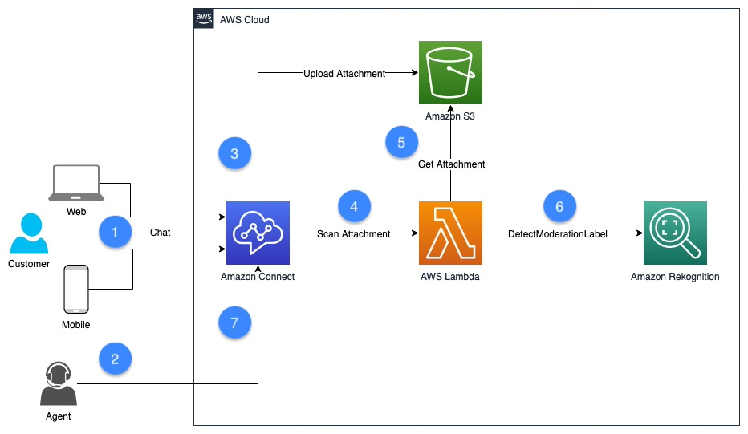

# Safeguard your environment and reduce reputational risk using Amazon Connect attachment scanning

## Introduction
This project deploys an attachment scanning solution based on Amazon Rekognition to identify inappropriate, unwanted, or offensive content in images based on general or business-specific standards and practices.

## Architecture


1.	Customer initiates a chat from your website using the [communications widget](https://docs.aws.amazon.com/connect/latest/adminguide/add-chat-to-website.html) hosted by Amazon Connect or mobile application using the [Amazon Connect Chat SDK](https://github.com/amazon-connect/amazon-connect-chat-ui-examples/)
2.	The chat is routed to an available agent based on your [contact flow](https://docs.aws.amazon.com/connect/latest/adminguide/connect-contact-flows.html) configuration.
3.	The customer or agent sends a [chat attachment](https://docs.aws.amazon.com/connect/latest/adminguide/enable-attachments.html) and the file is uploaded to Amazon S3 bucket
4.	Amazon Connect invokes the attachment scanner AWS Lambda function that handles scanning files
5.	Scanner Lambda function retrieves the file from S3 bucket
6.	Scanner Lambda function calls Amazon Rekognition [DetectModetationLabel](https://docs.aws.amazon.com/rekognition/latest/APIReference/API_DetectModerationLabels.html) API
7.	Amazon Connect marks the attachment APPROVED or REJECTED based on the Lambda status response. If the result is REJECTED, the attachment files in S3 are automatically deleted from both staging and final locations


## Prerequisties
- An AWS account
- An IAM User with programmatic access 
- An existing Amazon Connect instance with attachments enabled
- AWS IAM with access to create users, policies and roles
- A local installation of AWS SAM CLI and experience using the AWS CLI

## Deploy the solution

1.	Using Git, clone the repository from GitHub
```
git clone https://github.com/aws-samples/safeguard-your-environment-and-reduce-reputational-risk-using-amazon-connect-attachment-scanning
```
2.	Browse to the directory where the repository is downloaded
```
cd safeguard-your-environment-and-reduce-reputational-risk-using-amazon-connect-attachment-scanning
```
3.	Build the solution with SAM
```
sam build
```
4.	Deploy the solution
```
sam deploy
```

## Usage
After the SAM application is deployed, please follow the steps outlined in blog post [**Safeguard your environment and reduce reputational risk using Amazon Connect attachment scanning**](https://insert_link_to_blog_post)

## Useful commands
* `sam build`  creates .aws-sam directory that structures your application
* `sam deploy` deploys serverless application to the AWS Cloud

## Security
See [CONTRIBUTING](CONTRIBUTING.md#security-issue-notifications) for more information.

## License
This project is licensed under the MIT-0 License. See the [LICENSE](LICENSE) file.
